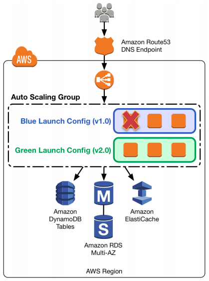

# AWS educate- cloud solutions architect path

## What is DevOps?
Few years back the Dev and Ops departments operated in silos. If anything breaks then one side raises a ticket for the other side. This way a lot of productivity is lost. 
DevOps brings these two sides together. It involves the use of
1. Tools: CI/CD to get constant test reports and artifacts. They enable developers to accomplish tasks which traditionally required help from other teams.
2. Culture: Developers, operations, QA and security teams become more tightly integrated.

### DevOps practices
1. Continuous integration
2. Continuous delivery- Perform small but frequent updates
3. Microservices- Faster development and more flexibility. 
Increased frequency of updates and use of multiple microservices can improve operational complexity. CI/CD can solve thse issues.
4. Infrastructure as code- Deploying infrastructure programatically instead of doing it manually. Eg. EC2 instance with NodeJs deployed using CLI. It has 3 levels:
    - Infrastructure
    - Configuration: Server like Tomcat
    - Policy: Helps ensure that stack is compliant with industry standards like PCI/DSS
5. Monitoring and logging- Eg cloudwatch and cloudtrail events used to monitor health of stack.
6. Communication and collaboration (part of culture)- between dev and ops teams

### CI / CD (part of DevOps)
1. Continuous integration (CI)- Devops practice where code is regularly pushed to a central repo. The CI system generates a build and runs tests against it.
- Has 3 different speeds
    1. Nightly checks (slow)- Build project every "night" to see if everything works.

    Cloudwatch scheduler ---> triggers Lambda ---> CodeBuild build

    This can be improved upon
    1. Automated dependency updation
    2. Send email notification

    Cloudwatch scheduler ---> triggers Lambda ---> CodeBuild build ---> cloudwatch log ---> SNS email

    2. Branch checks(medium)- Build project every time code is pushed to a specific branch.

    Codecommit repo pushed ---> Cloudwatch event ---> Codecommit build

    with Github
    Github commit ---> Webhook makes request to Codebuild ---> Codebuild build ---> report to Github (success / fail)
    
    3. PR checks: fast
2. Continuous delivery (CD)- Goes beyond unit testing to validate if artifact is production ready.

### Services used
1. **CodeCommit**: Github clone (source control repo)
2. **CodeBuild**: Travis clone
- Automatically builds repo based on yml script.
- Can be used to update dependencies, eg. removing npm shrinkwrap.json and regenerating it (package lock library that supports updates).
- Build badge: Passing or failing badge on github
- Caching: to speed up builds. Cached files stored to S3
- Can perform unit tests, integration tests, parallel builds
3. **CodeDeploy**: Automated deployments to production.
4. **CodePipeline**: The CD pipeline that reads from git repo and works with codebuild and codeDeploy.
5. **CodeStar**: Integrated environment to launch software stack templates, monitor repo, monitor CI/CD etc.

### DevOps terminologies
Reference: https://www.slideshare.net/AmazonWebServices/dvo401-deep-dive-into-bluegreen-deployments-on-aws/13

1. **Blue / green deployment**- Method to test if *new deployments work properly*. Blue and green server have identical hardware. Blue server (v1) is in production, the green server has a newer software version (v2) is kept idle. Gradually traffic is routed from blue to green server(**canary release**) and issues are fixed on the way. The cycle continues with the blue server being used for new release the next time.

2. **A/B testing**- Used to test new features for the application (not deployment). Group A and group B customers interacting with the app see different versions of UI. By recording conversion rate we can find which is the better feature.

3. **Canary releases**- Early release for testing the waters.

#### Definitions
1. Auto-scaling group- Group of EC2 instances treated as a logical unit for scaling and management.
2. Launch configuration- Template used by an auto-scaling group to launch EC2 instances.

#### Blue/green deployment patterns
With each successive pattern the environment boundary is becoming smaller.

##### EC2 and ECS
1. **Route 53 weighted DNS switching**- Route 53 switches DNS traffic from blue to green deployment. Each deployment has its own load balancer, ie load balancer is part of environment boundary.

- For both EC2 and ECS
- Disadvantages:
    - Higher roll back complexity. **DNS time to live (TTL)** has to be accounted for.
    - Almost double cost.

2. **Swapping auto-scaling/ECS groups behind ELB**- Elastic load balancer is common (out of environment boundary). It routes traffic between the green and blue environments.

- Better granularity

3. **Swapping launch configurations**- Launch configuration swapped to gradually reduce blue and increase green instances.

- Scaling out(add instances): Latest launch configuration used to create instances.
- Scaling in(remove instances): Instances with oldest configuration removed.
- Disadvantages:
    - Autoscaling tries to keep instance count equal across all availability zones. It may cause some green (newer) instances to be terminated. This needs to be accounted for.
    - Detecting issues in a hetrogenous fleet is more difficult.
    - Less granular traffic split
    - More costs: Overprovisioning during scale out.

##### ECS only
4. ECS service update- Task definition of each node is updated by ECS.

- Advantages:
    - Docker container advantage- preserves fidelty of the environment
    - Lower cost since it's a rolling deployment. No additional nodes needed.
- Disadvantage: No canary analysis

##### Database schema changes
###### Definitions
1. Schema- related to database
2. Code- related to environment

1. **Decoupled approach**: Database is outside environment boundary (decoupled from system).
- This has 2 approaches
    1. Make schema changes first: Old code changed to used new schema. This way database update is backward compatible.
    2. Make code changes first: New code uses old schema. This way code update is backward compatible.
- This approach provides simplicity at cost of increased risk. For example, new schema may not work with the codebase. Testing and operations bust be strong.

2. **When database can't be decoupled or when deployment is done across availability zones**- Database is part of environment boundary. But here both blue and green environments need to have access to same data (eg. new user data needed even when rolling back).
- Approaches:
    1. Have a central queue (EC2) where blue and red push changes. The queue passes data to a service worker which writes to databases of both environments.
    
    2. Blue writes to its own database, then asynchronously passes data to Green: Done when Blue has high consistency requirements.
    3. Each writes to its own database. An asynchronous process (DynamoDB stream) writes data to the other environment's database.
    

