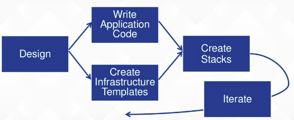
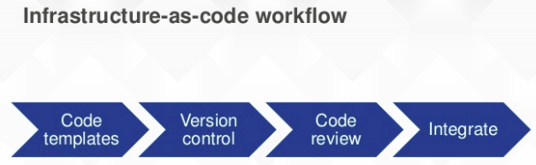

# Infrastructure as code
Infra resources on cloud can be programatically deployed, similar to application code. This ensures that every copy of a resource is exactly the same.





## Comparison of technologies- puppet, chef, ansible, terraform, cloudformation
### 1. Configuration management vs provisioning tools
1. Configuration management tools(puppet, chef, ansible)- Install software on existing servers
2. Provisioning tools(cloudformation, terraform)- Provision servers themselves (from cloud)

### 2. Mutable vs immutable infra
1. Mutable(puppet, chef, ansible)- Configuration of servers can be changed. But this can lead to **configuration drift**.
#### Configuration drift- As gradual changes are made to servers, a server may become slightly different from others. This can create subtle bugs that are difficult to diagnose.

2. Immutable(TF, CF)- Each change is deployment of a new server.

### 3. Procedural vs declarative
1. Procedural (chef, ansible)- We need to write code step by step to achieve a desired end state. Eg. first we write code to deploy 10 servers. To increase count to 15 we need new code to add 5 servers. To update the OS we need separate code.  
Code for 10 servers  
```
- ec2:
    count: 10
    image: ami-v1    
    instance_type: t2.micro
```
Code for 5 more 
```
- ec2:
    count: 5
    image: ami-v1    
    instance_type: t2.micro
```

- Disadvantages:
    - Must know state and unique commands for every action
    - Order of execution matters
    - Can't reuse code.

2. Declarative(terraform)- Same template can be changed to make changes to servers.
```
resource "aws_instance" "example" {
  count         = 10
  ami           = "ami-v1"
  instance_type = "t2.micro"
}
```
Here count can be changed to 15 from 10. We *directly specify end state* while the IAC tool figures out how to achieve this.

### 4. master vs masterless
1. Master(chef, puppet)- Require a separate master server for storing state and pushing updates
- Advantages:
    - Run continuously and enforce configuration.
    - Central place to manage infrastructure
- Disadvantages: Increased cost and surface area for attacks

2. Masterless(terraform, ansible)
- Terraform communicates with cloud providers's APIs to deploy servers. It just needs the security credentials.
- Ansible: Uses SSH to make changes to servers.

### 5. Agent vs agentless
1. Agent(Chef, puppet)- Require agent software to be installed. This creates deployment issues and increases attack surface(keeping ports open, passing updates).
2. Agentless
- Terraform: Cloud providers have own agents
- Ansible: SSH

## Services used
1. **Service catalog**- Allows IT organization to store and share their cloudformation templates.
2. **Systems manager**- 
- Single window to view and visualize operational data. This helps for security and compliances.
- Allows catagorization of running services into different groups groups
- Automation: patching, enforcing firewall policies, updating antivirus
- Global parameter store for AWS
3. **AWS config**
- Records config changes in AWS resources for monitoring and compliance.
- **Compliance as code**- Create config rules with AWS config and automate remedial actions with **Systems manager**.
4. **Cloudtrail**- Records what users/devs/admins do in AWS cloud. Eg. logging in, starting EC2 etc.
5. **Cloudwatch**- Records what happens with AWS resources. Includes logs, events, alarms and metrics
6. **OpsWorks**-Provides master server for Puppet and Chef. It has 3 modes-
    1. OpsWorks for Chef
    2. OpsWorks for Puppet
    3. AWS OpsWorks stacks- Managed service based on chef. It allows different resources to be visualized and managed in form of stacks. Eg. Database layer, application layer etc.
7. **Cloudformation**- Infrastructure as code template creation. It generates end-resources without user having to worry about order of generation, API calls etc.
- **Custom resources**: Non AWS services can be integrated.
- **Lambda backed custom resources**: Lambda performs computation like finding IP address.

- **AWS::CloudFormation::Init** command: Allows 3rd party tools like Chef or application code to be added. Cloudformation is mainly an infrastructure provisioning tool but can also perform configuration. Sometimes CloudFormation is used with config tools like Chef, Puppet and AWS OpsWorks.
8. **Cloudformer**- GUI for creating cloudformation templates.

