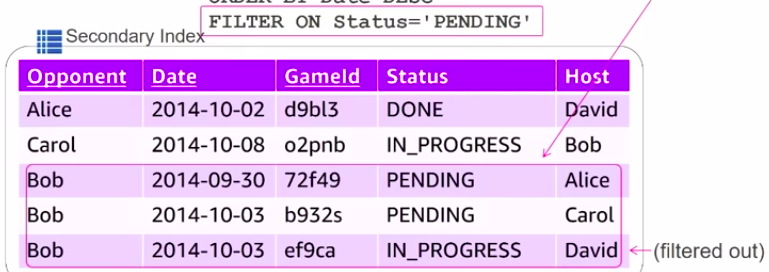
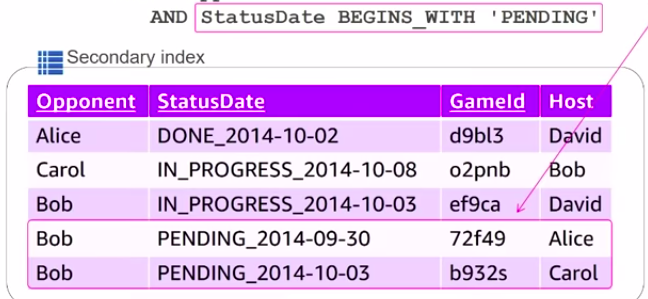

## Terminologies

1. **Table**- A collection of items
2. **Item**- Collection of attributes (row)
3. **Attibute**- Consists of key value pairs (column)
4. **Primary keys**- Of 2 types
   - **Hash/partition key**: Single attribute to uniquely identify items. Used as input for an internal hash function. The hash value determines in which partition the item will be stored.
   - **Range/sort key**: Used along with hash key to form the composite primary key. Items with same hash are stored contiguously in the same partition. They are sorted based on the UTF-8 value of sort key.

- Supported data types: String, Number, or Binary

5. **Throughput**: 
Measured in terms of **request units** for on-demand mode and **capacity units** for provisioned mode. Both units are similar.

- **Read request unit**- One unit equals
  - 1 eventually consistent read(read from nearest replica node- dynamoDB automatically creates replicas) for 8KB data; or
  - 1 strongly consistent read for 4KB data; or
  - 1 transactional read(read from primary node) for 2KB data

- **Write request unit**- Equals a 1KB standard write or 0.5KB transactional write per second.

6. **DynamoDB streams**: Near realtime stream of DynamoDB CRUD events.  
Applications:
- As lambda function trigger: Eg. sending email with SNS.
- Data replication across regions.

## DynamoDB indexing

Database index is used for querying.

1. Default: DynamoDB builds a hash index and range index over the primary key(hash and range type)
2. Secondary index: Allows you to query data based on an alternate key. Secondary index can be **non-unique**.

### Secondary index types

1. **Global secondary index**

   - Stored separately from base table and scales separately. It has a separate name and separate storage and provisioning costs.
   - Global: spans across all partitions of base table. Allows querying across all partitions.
   - Partition key and sort key can be different from that of base table.
   - No size limitation.
   - Can be created/deleted after table is created.
   - Only **eventual consistency** for reads. The index is automatically updated in an eventually consistent fashion when data is added to base table. This means that write capacity for index is also consumed. Two write operations are needed if data in base table is updated (delete + add new).
   - Separate provisioned capacity.

   ```
   total write capacity consumed = base table WC + global secondary index WC
   ```

   - Max 20 GSIs (defalt limit, can request increase)

2. **Local secondary index**
   - Partition key(hash key) is same as base table, sort key(range key) is different. Created when partition key needs to be sorted based on a different attribute.
   - 10GB index size limit.
   - Can't be created/deleted after table is created.
   - Both **seventual and strong consistency**.
   - Consumes capacity from base table.

#### Projection

- Base table attributes are not present in secondary index by default and must be projected. However **primary key attributes(hash+sort) of base table are always projected** as non-key attributes. For local secondary index the sort key of base table is projected as a **non-key attribute**.
- Global secondary index only tracks items when key-values for that index are present. Eg. An item lacking TopScore (hash/sort key for secondary index) will not be projected to that index.

## DynamoDB data types
1. **Scalar types**: Number(including float), string, binary, boolean, null. Empty strings are not allowed.
2. **Set types**: An unordered set of numbers, strings or binary values.
    - Order is not preserved
    - All items must be unique
    - All items must be of same type
    - Sets can't be empty
    Eg.
    ```
    [1, 10, 30]
    
    ["a","bc"]
    ```

3. **Document types**: They include
    1. **List**: Ordered collection of values enclosed in square brackets. It's like a **JSON array**.
    - A list can be empty.
    - Can store dissimilar values.
    ```
    [1, "abc", 2345]
    ```
    
    2. **Map**: An **unordered collection** of name-value pairs. It's enclosed in curly backets. It's like a **JSON object**.
    ```js
    {
    name: "cat",
    age: 5
    }
    ```
#### DynamoDB allows deeply nested data within sets, lists and maps to be queried.

### General properties of document types:
- They can be nested within each other, forming complex data structures.
- Can be empty, unlike strings or sets.

## Size limits
- 400KB per **item**: An item includes all attributes plus attribute names.
- 2KB for partition key
- 1KB for sort key


## DynamoDB features

1. Encryption at rest
2. Point in time recovery- Can recover table at any point of time during _last 35 days_.
3. Time to live- auto delete data when no longer needed.

## DynamoDB API

### 1. Control plane

For managing tables

1. **CreateTable**
2. **DescribeTable**
3. **ListTables**
4. **UpdateTable**
5. **DeleteTable**

### 2. Data plane

For CRUD operations on data in a table.

#### Create
1. **PutItem**: Single item.
2. **BatchWriteItem**: Upto 25 items

#### Read
1. **GetItem**: Sigle item. Complete primary key(partition+sort) must be specified.
2. **BatchGetItem**: Upto 25 items.
3. **Query**: Returns all values with given partition and sort keys. **KeyConditionExpression** can be applied on primary key(H+R). **FilterExpression** is applied when query execution finishes. It can contain only non-primary key values.
4. **Scan**: Returns all items in table (maximum 1MB size). Expensive operation.

#### Update
1. **UpdateItem**: Acts like 'upsert'(update if exists, otherwise add). Can also perform conditional updates or use atomic counters for incrementing/decrementing.
```js
UpdateExpression: "SET Plays = Plays + :incr",
ConditionExpression: "Plays <= :maxPlays",
ExpressionAttributeValues: { 
  ":incr": 1,
  ":maxPlays": 10
}
```
#### Delete
1. **DeleteItem**: Delete single item based on primary key.
2. **BatchWriteItem**: Delete upto 25 items.

### 3. DynamoDB streams
1. **ListStreams**
2. **DescribeStream**: return stream info
3. **GetShardIterator**: Returns shard iterator, a data structure used to retrieve records from streams.
4. **GetRecords**: Retrieves records for a given shard iterator.

### 4. Read and Write modes
1. Read- Eventually consistent, strongly consistent, transactional
2. Write- Standard, transactional

### 5. Transactions
Provide atomicity, consistency, isolation and durability (**ACID**). They can be performed across **multiple tables**.
1.  **TransactWriteItems**: Batch operation for Put, Update or Delete operations. Gives guranteed all-or-nothing result.
2. **TransactGetItems**: Batch Get operation.

## SQL vs DynamoDB operations

|             | SQL                                                           | DynamoDB(NoSQL)                               |
|-------------|---------------------------------------------------------------|-----------------------------------------------|
| Create data | INSERT INTO                                                   | PutItem, BatchWriteItem                       |
| Read data   | SELECT, WHERE (can be used for joins between multiple tables) | Scan, Query, GetItem, BatchGetItem (no joins) |
| Update data | Update                                                        | UpdateItem                                    |
| Delete data | DELETE                                                        | DeleteItem, BatchDeleteItem                   |

## Basic operations (Javascript SDK)

1. Parameters to pass

    ```js
    let params = {
      TableName: "Image",
      KeySchema: [
        {
          AttributeName: "Id",
          KeyType: "HASH"
        }
      ],
      AttributeDefinitions: [
        {
          AttributeName: "Id",
          AttributeType: "S" //string type
        }
      ],
      ProvisionedThroughput: {
        ReadCapacityUnits: 1,
        WriteCapacityUnits: 1
      }
    };
    ```

2. Create table
       It creates table and returns status (same as describeTable())
    
    ```js
    dynamodb.createTable(params, function(err, data) {
      if (err) ppJson(err);
      else ppJson(data);
    });
    ```
    
    Javascript callbacks- Executes particular code immediately after a function finishes execution.
    
    ```
    function add(a,b,callback){
        console.log(a+b);
        callback();
    }
    
    add(5,1, function(){
        console.log('called immediately after add');
    });
    ```
    
    JS needs callbacks because it is asynchronous. Otherwise normally we write code one line after another.

3. Describe table

    ```js
    let params = {
      TableName: "Image"
    };
    dynamodb.describeTable(params, function(err, data) {
      if (err) ppJson(err);
      else ppJson(data);
    });
    ```

4. Put items

    ```js
    const docClient = dynamodb.DocumentClient(); //simplifies CRUD
    let params = {
        TableName: 'Image',
        Item = {
            Id: 'myimage.png',
            DateAdded: new Date().toISOString(),
            VoteCount: 0
        }
    };
    docClient.put(params, function(err,data){
        if (err) ppJson(err);
        else console.log('added successfully'); //Returns no data
    })
    ```

5. Get items

    ```js
    let params = {
      TableName: "Image",
      Item: {//By default all attributes are returned
        Id: "myimage.png"
      },
      //ProjectionExpression: "Votes, ImageId"
      //to specify which attributes to display use 'ProjectionExpression'
    };
    docClient.get(params, function(err, data) {
      if (err) ppJson(err);
      else ppJson(data);
    });
    ```

6. Batch write- Write upto 25 items at one time. _Some of the writes may fail_(NoSQL shenanigans). Individual put requests are atomic but batchWrite is not. This can be handled by recursive callbacks.
    
    ```js
    docClient.batchWrite(params, doBatchWriteItem);
    
    function doBatchWriteItem(err, data) {
      if (err) ppJson(err);
      else {
        if ("UnprocessedItems" in data) {
          var params = {
            RequestItems: data.UnprocessedItems
          };
          console.log(
            "calling again. Got " +
              params.RequestItems.Image.length +
              " unprocessed items"
          );
          docClient.batchWrite(params, doBatchWriteItem);
        } else console.log("no items");
      }
    }
    ```
    
    Batch operations have different params syntax
    
    ```js
    let params = {
      RequestItems: {
        Image: [
          //table name
          {
            //separate item for each operation
            PutRequest: {
              //for write
              Item: {
                Id: "newimage.png", //required- key
                //other attributes
                DateAdded: new Date().toISOString(),
                VoteCount: 0
              }
            }
          },
          {
            PutRequest: {
              Item: {
                Id: "dynamodb.png",
                DateAdded: new Date().toISOString(),
                VodeCount: 0
              }
            }
          }
          //more for every operation
        ]
      }
    };
    ```

7. scan()- returns multiple items. It's not good for querying. Results have maximum 1MB size, **LastEvaluatedKey** is returned for pagination. **Limit** paramter can be used to specify max number of items to be returned (upto 1 MB).

    ```
    let params = {
        TableName: 'Image',
        Limit: 5
    }
    docClient.scan(params, function(err, data){
        if (err) ppJson(err);
        else ppJson(data);
    })
    ```

8. Pagination with scan()
   1. Set _ExclusiveStartKey_ as _LastEvaluatedKey_
   ```js
   var params = {
     TableName: "Image",
     Limit: 5
   };
   function scanCallback(err, data) {
     if (err) ppJson(err);
     else {
       ppJson(data);
       if ("LastEvaluatedKey" in data) {
         params.ExclusiveStartKey = data.LastEvaluatedKey;
         console.log("scanning again from " + data.LastEvaluatedKey.Id);
         docClient.scan(params, scanCallback);
       } else console.log("reached the end");
     }
   }
   docClient.scan(params, scanCallback);
   ```
   2. Using `eachPage(err, data, done) => {}`
   ```js
   var params = {
     TableName: "Image"
   };
   docClient.scan(params).eachPage((err, data) => {
     if (err) ppJson(err);
     else {
       ppJson(data);
       console.log(done()); //done called for each page
     }
   });
   function done() {
     return "gggg";
   }
   ```

9. Create ImageTag table:
    
    - Attributes: Tag(HK), ImageId(SK), VoteCount  
      Allows finding images per tag.
    
    - To find tags per image
      Global secondary index: ImageId(HK), Tag(SK)
    
    - To find votes per tag
      Local secondary index(HK is common): Tag(HK), VoteCount(SK)
    
    ```js
    //ImageTag(base table), ImageId-index(global), VoteCount-index(local)
    let params = {
      TableName: "ImageTag",
      AttributeDefinitions: [
        {
          AttributeName: "Tag",
          AttributeType: "S"
        },
        {
          AttributeName: "ImageId",
          AttributeType: "S"
        },
        {
          AttributeName: "VoteCount",
          AttributeType: "N"
        }
      ],
      KeySchema: [
        {
          AttributeName: "Tag",
          KeyType: "HASH"
        },
        {
          AttributeName: "ImageId",
          KeyType: "RANGE"
        }
      ],
      ProvisionedThroughput: {
        ReadCapacityUnits: 1,
        WriteCapacityUnits: 1
      },
      GlobalSecondaryIndexes: [
        {
          IndexName: "ImageId-index",
          KeySchema: [
            {
              AttributeName: "ImageId",
              KeyType: "HASH"
            },
            {
              AttributeName: "Tag",
              KeyType: "RANGE"
            }
          ],
          Projection: {
            ProjectionType: "KEYS_ONLY"
          },
          ProvisionedThroughput: {
            ReadCapacityUnits: 1,
            WriteCapacityUnits: 1
          }
        }
      ],
      LocalSecondaryIndexes: [
        {
          IndexName: "VoteCount-index",
          KeySchema: [
            {
              AttributeName: "Tag",
              KeyType: "HASH"
            },
            {
              AttributeName: "VoteCount",
              KeyType: "RANGE"
            }
          ],
          Projection: {
            ProjectionType: "INCLUDE", // (ALL | KEYS_ONLY | INCLUDE)
            NonKeyAttributes: ["ImageId"]
          }
        }
      ]
    };
    ```

## Querying

Querying is done with **KeyConditionExpression** parameter. It supports the following operations:

1. Hash key: a = b
2. Range key: a < b, a <= b, a = b, a >= b, a > b, a BETWEEN b AND c, begins_with(sort_key_name, :sort_key_val)

### Syntax

1. **ExpressionAttributeNames**(optional): When attribute names are keywords or they're stored in separate files. They're substituted into placeholders with _'#'_ sign.
2. **ExpressionAttributeValues**(mandatory): Values can't be directly used in KeyConditionExpression. They must be substituted into placeholders with _':'_ sign using ExpressionAttributeValues.

```js
//query ImageTag table for all images with the tag 'Database
let params = {
  TableName: "ImageTag",
  KeyConditionExpression: "#myName = :myTag", //query both partition and range key using 'AND'
  //KeyConditionExpression: "#myName = :myTag AND sortKey = :mySortKey",
  ExpressionAttributeValues: {
    ":myTag": "Database"
  },
  ExpressionAttributeNames: {
    "#myName": "Tag"
  }
}; // gives result based on sort key ImageId

docClient.query(params).eachPage(function(err, data) {
  if (err) ppJson(err);
  else if (data) ppJson(data);
});
```

### Index for querying

1. Local

```js
let params = {
    TableName: 'ImageTag',
    IndexName: 'VoteCount-Index', //local or global, global index may have different hash key
    KeyConditionExpression: 'Tag = :myValue'
    ExpressionAttributeValues: {
        ':myValue': 'Database'
    },
    ScanIndexForward: false //gives descending results, default is true (ascending)
};// gives result based on Votes (local secondary index)
```

```js
  KeyConditionExpression: "#myName = :myTag",
  ExpressionAttributeValues: {
    ":myTag": "Database"
  },
  ExpressionAttributeNames: {
    "#myName": "Tag"
  }
```

## Exercise
Find question bank for SQL problem. Write solutions in both SQL and DynamoDB

## Other factors
1. Capacity distribution: User's read/write capacity is distributed across his partitions. Eg. if user has 100 write capacity and 10 partitions, each partition will have 10 write capacity units. The user has to ensure that requests are evenly made to all partitions otherwise some partitions may cause throttling.
2. **Adaptive capacity**: Partitions can borrow capacity from other partitions.
2. **Hard limit** on each partition: 3000 read capacity units, 1000 write capacity units

## Schema design strategy
1. Key selection
    1. Partition key only
        - Key is globally unique
        - Performing key based lookup
    2. Partition+sort key
        - Non-unique sort key
        - Range based queries
    3. Other strategies
        1. Prefix/suffix to get unique partition key: to evenly distribute records across partitions
        2. Composed partition key: Combine with any other field to get unique key
        
           Example 1: Find pending games
           1. Table 1: name(partition key), date(sort key), Status: We'll require a local secondary index or will need multiple reads and filtering(anti-pattern).
           
           ```
           FILTER ON Status='PENDING'
           ```
           2. Table 2: name(partition key), statusDate(sort key): Can find using sort key itself.
           
           ```
           StatusDate BEGINS_WITH 'PENDING'
           ```
           
           Example 2: hierarchical data(address)
           Country(partition key): India
           Location(sort key): Maha#Mum#Powai 
       
        3. DynamoDB accelerator: Cache to bypass hard limit on write/read units
2. Identify access patterns and model table accordingly. NoSQL is inefficient for ad-hoc queries.
3. **Use one table per application**, avoid relational patterns
4. Use **DynamoDB streams**:
    - They're disconnected from the actual table, don't cause availability problems.
    - Calculate metrics using streams and store them back into table.
    - **Load stream data into other services like elasticsearch**
5. Use **global secondary index** to model many-to-many relationships. This allows reverse lookup.
6. **'Expected'** parameter- Performs condition check before running update() function. Use case- a user can't play multiple moves in a single turn of tik-tak-toe.
7. **Read/modify/write pattern**(alternative to option 2)- Store version in database. To make n+1th transaction, the transaction state must be valid and current state must be n. Otherwise transaction fails. Then replace the database value with new version value.