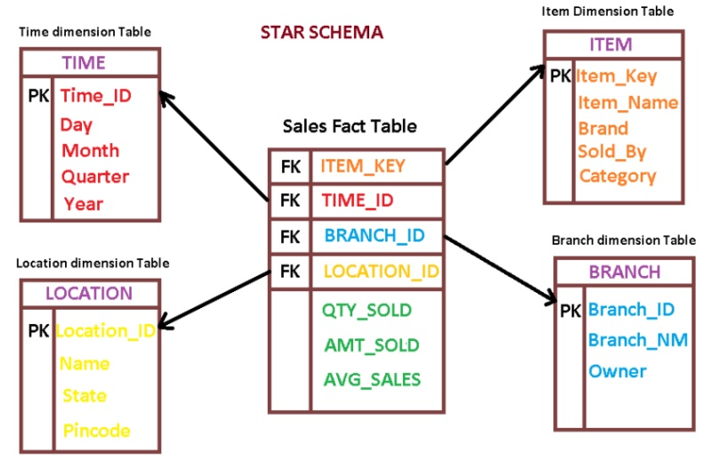

# Storage services
1. **S3**- blob storage, good for images, videos etc to be shared on web.
2. **Elastic block storage**- Block store that needs EC2 to work. It can't be shared between multiple EC2 instances at same time. An EBS instance is restricted to its AWS region.
3. **Elastic file system**- Network shared file system for EC2. Available across different regions and can be used by multiple EC2 instances at same time. More expensive.

# Data migration services
1. **Direct connect**: Direct link to AWS network. Can be done through partner solution providers.
2. **Import/Export disk**- Physically transfer hard drives.
3. **Snowball**- AWS owned rugged storage devices for transport.
- Use cases: cloud migration, disaster recovery, datacenter decomission
4. **AWS storage gateway**: Hybrid cloud storage service. On premise computers can add data to AWS cloud like any regular file system.
- Tape gateway: virtual tape storage for backup softwares.
- File gateway: Store files on S3
- Volume gateway: On premise system gets access to EBS.
- Caching
5. **AWS Kinesis**: For getting live data from multiple sources.
    1. **Kinesis data firehose**:
        - Managed service, handles scaling.
        - Ingesting into select data stores/analytics tools ie. S3, RedShift, ElasticSearch and Splunk(analytics tool). 
        - **Near real time** (lag possible)
    2. **Kinesis data streams**:
        - More customizable but user must manage provisioning and scaling.
        - Can integrate with other services like EMR Spark, EC2, Lambda
        - **Real time**
    3. **Kinesis video streams**: Streaming video for storage, analytics etc.
    4. **Kinesis data analytics**: Performing SQL queries on real time data.
6. Acelerating data transfer via web- S3 transfer acceleration, cloudfront(CDN)

# Data warehouse and Data Lake
Both store operational big data from various sources.

|                   | Data warehouse                                                                                               | Data lake                                                                     |
|-------------------|--------------------------------------------------------------------------------------------------------------|-------------------------------------------------------------------------------|
| Schema            | Designed prior to warehouse implementation (schema on write). Columnar formats like apache parquet, orc used | Written at time of analysis(schema on read)                                   |
| Data quality      | Refined data stored after extract, transform, load(ETL) process                                              | Raw data                                                                      |
| Storage structure | Hierarchically stored                                                                                        | Flat architecture                                                             |
| Storage           | Higher storage cost                                                                                          | Lower cost                                                                    |
| Use case          | OLAP analysis                                                                                                | OLAP analysis. Data may be fed into analytics tools or into a data warehouse. |

## 1. Redshift- Data warehouse
1. Columnar store warehouse
    - Column data is stored sequentially on drive, needing less reads
    - Better compression: All datatypes are same. Eg. all countries are stored together.
    - Row based database is good for user centric applications. Eg. querying a user to find username, hours played etc. Columnar databases are needed to answer questions about aggregates, eg. how many users logged in today, at what time is the site most active etc.


2. Architecture:

Each warehouse is made of nodes that are grouped into clusters. Each cluster runs one Redshift engine which contains the databases (parallel processing: many nodes per one engine).
    1. **Leader node**: coordinates the nodes in each cluster, stores metadata and serves as endpoint for SQL queries. Has no extra cost.
    2. **Compute nodes**: can store upto 160GB.
    3. **Spectrum nodes**: For direct querying against S3.


Nodes have 2 storage formats
    1. Compute optimized: SSD
    2. Storage optimized: Magnetic

3. Terminologies
    1. **Blocks**: 1MB immutable blocks to store columnar data in compressed format. Each block can hold millions of values.
    2. **Zone maps**: In memory data structure to store metadata about blocks (min, max values). This helps prune out values for querying. They're automatically created.
    3. **Sort key**: Indexes database based on specified attribute (eg. date). This helps prune the zone maps for beter I/O. It is suitable for columns  with lower cardinality(more repeated values). Eg. multiple rows per date.

    ### **Cardinality**- Measure of uniqueness of items in a column. Higher cardinality means more unique values.
    4. **Slices**: Virtual nodes within each node. Table rows are divided into slices and each slice only processes its own data.
    5. **Disks**: Storage devices attached to each node. They have 2-3 times higher capacity than the size advertized for each compute node. Each disk has 2 partitions:
        - Local storage: Used by same compute node
        - Mirrored storage: Accessed by remote compute nodes
    6. **VACCUM query**: Globally sorts table and deletes rows marked for deletion.
    7. **ANALYZE query**: Collects table statistics

### Data redundancy
1. Commit- Ensures all permanent tables have written blocks to another node.
2. **Temporary tables**: Faster, but do not mirror data.
3. **S3 automatic backups**: Every 8 hours or for every 5GB of changed data

### Transactions
Redshift is transactional and ACID compliant. It has 2 levels of commits, local and global. However commits have high overhead(OLAP not OLTP warehouse).
### Data distribution strategies
1. **KEY**:
- Based on hash value of specified key
- Good for improving JOIN performance on large tables.
- **Row skew**: Ratio of items on largest slice to smallest slice. It should be ```~1```. Otherwise this means that some slices have suboptimal amounts of data.

2. **ALL**:
- Entire data stored on first slice of each node.
- Good for smaller tables.

3. **EVEN**: Round robin distribution managed by RedShift.
- Used when user is unsure or the other styles are not optimal.

### Warehouse design (star/snowflake schema)


1. **Dimension table**: Contains detailed domain level information.
2. **Fact table**: Contains primary keys of dimension tables and aggregate metrics (average sale, highest sale). They're larger than dimension tables because they hold data from multiple dimension tables.
3. **Materialized views**: Precalculated tables holding summaries.

#### Redshift best practices
1. Keep often accessed values in fact table
2. Create materialized views for often accessed data.
3. Keep datatypes as small as possible. Eg. low VARCHAR length for small strings.
4. Use compression.
5. Use sort keys.
6. Made for batch writes- small writes have same cost as large writes

3. Pricing: Charged per node-hour. Leader node is not charged.

## 2. Data lakes
### Evolution

Hadoop's role changed from a place for storing data to a processing engine. AWS S3 allowed decoupling of storage and compute for big data analytics. The place where data is stored is the 'data lake'.