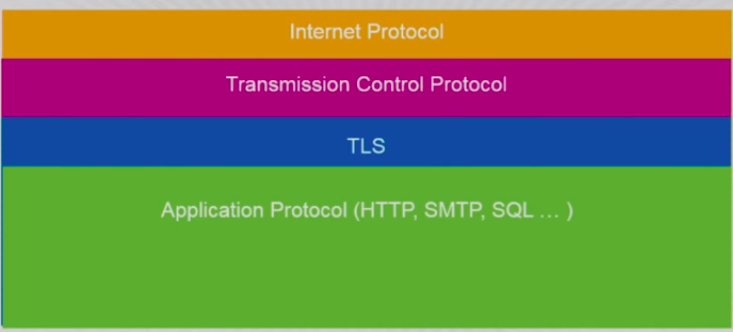
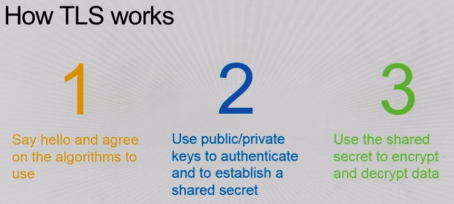

# Distributed systems
## Challenges
1. Commodity hardware
2. Scale
3. Concurrency, latency
4. Fault tolerance
5. Elastic computing

## Distributed systems primitives
### 1. Group membership
- Ability to add and remove members from a group.
- Protocols to resolve **split brain scenario**- 2 nodes believe themselves to be active nodes.

### 2. Discovery
Finding who are members of a particular group, their I.P addresses etc.
#### Approaches
1. **Config file**: A file containing IPs of all nodes.
- Advantages: Simple to use
- Disadvantages: Must be manually changed, can't scale

2. **DNS**: DNS maps domain names to IP addresses.
- Advantages: Universally adapted, infra already exists
- Disadvantages: Mapping can't be rapidly changed due to caching.

3. **Gossip protocol**: Each node keeps messaging nearby nodes about its status and view.
- Advantages: Simple
- Disadvantages: Different nodes can have different views. This creates inconsistencies.

4. **Metadata store**: Nodes write to this store upon bootstrap. AWS stores most of its metadata in DynamoDB.

### 3. Metadata store
Characteristics:
1. **Simplicity**: Keep access patterns simple. Eg. avoiding joins.
2. **Availability**
3. **Scalability**

### 4. Failure detection
In distributed systems there's no way to know if a node has failed or become silent due to network issues. False positives are inevitible.

#### Solutions
1. Heartbeat protocol: Check for liveliness instead of failure. Do not let components go silent.
2. Gossip based heartbeat propogation: Gossip protocol to spread heartbeat of nodes.
3. Use leases instead of locks to allocate resources.

### 5. Workflows
Simple workflows can be built upon a shell/python script. However if an intermediate state fails then entire workflow fails. It can't gurantee idempotency.

**Idempotency**: Same response returned every time.

#### Solution
Decompose workflows into simpler activities. Every activity writes its state into a metadata store. This is implemented by AWS **Simple Workflow service**.

## Underlying problem with distributed systems-  **consensus**
Consensus refers to a series of distibuted systems agreeing upon something. AWS uses a **transaction journal** based on **Paxos protocol** to solve this issue.

# Virtual private cloud
In VPCs local IP addresses are assigned to resources. It's isolated from the internet and can communicate to it using route tables and internet gateway.
## Security
1. Security groups: Restrict IP addresses of different resources. They follow **principle of least privilage**.
2. **Subnets**: Logical division of VPC into sub-networks.
3. **VPC flow logs**: Visible from cloudwatch

## Connecting to internet
1. **Internet gateway** and **route tables** 
2. **Network address translation(NAT) gateway**: For outbound only internet access. Traffic is proxied through this gateway.

## Connecting to user's infrastructure
1. **SSH bastion**: Allows SSH connectivity only from specified IP addresses.
2. On premise servers: **VPN** or **AWS direct connect**
3. **VPC peering**: Connect to other VPCs

## Other features
1. **Private DNS with route 53**: Can assign own domain names that behave differently from domains outside. Eg. private google.com
2. Connecting to **AWS services**: Through **internet gateway** or through **PrivateLink** (Privately connect to AWS services).

## VPC debugging tools
1. **Traceroute**: Path taken and time taken by message to travel from client node to destination node.
2. **MTR**(my trace route): Combines task of Traceroute and PING. It constantly analyzes network performance.
3. **Hping3**: Packet analyzer.


# Web log analysis
## 1. Syslog protocol
Introduced numerical codes:
1. Facility(where messages are coming from): 0(kernel), 1(user-level messages), 2(email)
2. Severity: 0(emergency), 1(alert), 2(critical), 3(error), 4(warning), 7(debug)

<facility*8+severity>
```
<34>1 2003-10-11T22:14:15.003Z mymachine.example.com su - ID47 - BOM'su root' failed for lonvick on /dev/pts/8
```
Here facility=4, severity=2

## 2. Common log protocol/ Apache HTTPd

## Steps for log data analysis
1. Generate useful data: Log data can be customized.
2. Get log data off your hosts: Use daemons like syslog-ng, nxlog to send logs to a log storage service. Use analytics tools like Splunk or Logstash.
3. Analyze data: Kibana, Splunk
4. Reacting to log data: eg. cloudwatch alarms with SNS email
5. Log backup

# Secure socket layer(SSL)/Transport Layer security(TLS)
Used for HTTPS. SSL is now known as TLS(transport layer security).

## TLS operations
1. Hash/Checksum: Each binary document produces a unique and replicable checksum for itself. This checksum can't be obtained from other files.
2. Encryption:
    - Public key cryptography(asymmetric cryptography): Public-private key pair created. Algorithms like RSA, AES used.
    - Symmetric cryptography
3. Signatures: Combination of hashes and public/private key cryptography.

### Signature working
Server generates checksum of document, encrypts it with its private key and sends it to the client. The client computes the document checksum and compares it with the checksum sent by the server(decrypted using public key with the client).

## How TLS works

TLS fits transparently between TCP and HTTP. TLS and HTTP both fall in the application layer(topmost) of TCP/IP protocol.

Steps
1. Hello: Agree on algorithms to use
2. Use keys to authenticate and establish a shared secret.
3. Used shared secret to encrypt/decrypt data.


## Online certificate status protocol(OCSP)
Web server with private key polls the certificate authority to get a token(small lifetime of few hours). This token is sent with every SSL request. The token is then verified by the browser.

# End user services
1. **AWS workspaces**: Cloud desktop as a service
2. **AWS workdocs**: Google docs/sheets clone
3. **AWS Appstream**: Desktop application streaming
4. **AWS directory service**: Cloud based common directory for on premise systems

# Identity federation
