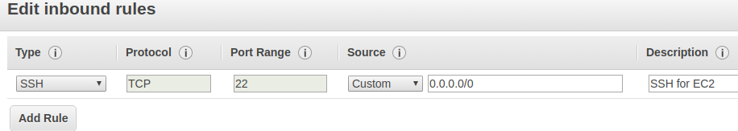
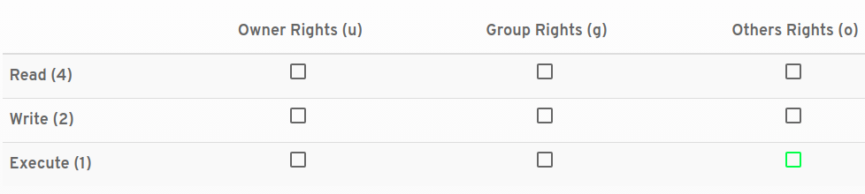
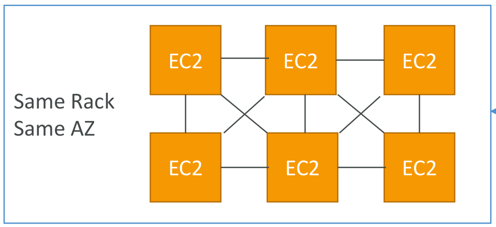
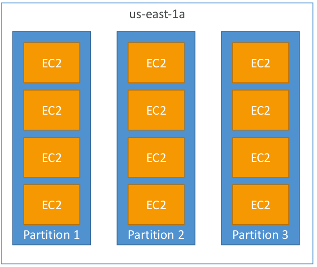
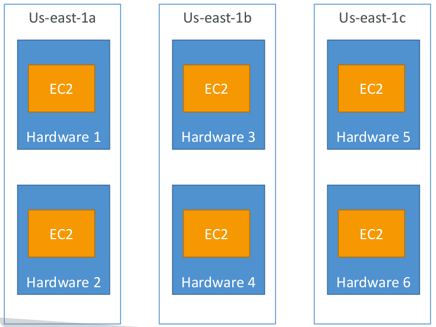

# EC2

## Terminologies
1. Tenancy
    1. Shared: On VM
    2. Dedicated instance: Runs on hardware dedicated to a single customer. But AWS decided which hardware to use.
    3. Dedicated host: Like dedicated instance. But user decides what hardware to use.
2. PEM keys: Public key with EC2, private key with user. Private key is used by user to SSH into server in case of Linux or for entering password in case of Windows.

## Security groups
- They are firewalls which control how traffic is allowed in or out of EC2.

For example opening port 22 for SSH traffic from all IP addresses


- They regulate:
    - Allowed IP addresses(v4 and v6)
    - Allowed ports
    - Control inbound and outbound traffic.
- Locked down per VPC and per region
- Can be attached to multiple EC2 instances
- Live outside of EC2:
    - Timeout: security group issue
    - Connection refused: application error
- Security groups can reference other security groups. Eg. An EC2 instance can authorize instances belonging to select security groups.
- By default block all inbound traffic and allow all outbound traffic.

## Connecting to EC2
1. Using SSH terminal
```sh
chmod 400 
ssh -i "./secrets/learn_ec2_keys.pem" ec2-user@ec2-13-233-61-146.ap-south-1.compute.amazonaws.com #using DNS
ssh -i "./secrets/learn_ec2_keys.pem" ec2-user@13.233.61.146 #using IP
```

Keys must be hidden from others using chmod command. Otherwise we get **permissions 0644** error.
```sh
@@@@@@@@@@@@@@@@@@@@@@@@@@@@@@@@@@@@@@@@@@@@@@@@@@@@@@@@@@@
@         WARNING: UNPROTECTED PRIVATE KEY FILE!          @
@@@@@@@@@@@@@@@@@@@@@@@@@@@@@@@@@@@@@@@@@@@@@@@@@@@@@@@@@@@
Permissions 0644 for './secrets/learn_ec2_keys.pem' are too open.
```

### chmod(change mode) command
Used to set file access mode in linux. ```chmod 400``` means read-only permissions that too only for the user.


644 mode(warning message) means:
    1. user: read and write
    2. group: read
    3. others: read

## Exiting
Ctrl+D or ```exit```

## EC2 IP addresses
EC2 has 3 types of IP addresses
1. Private: Stays even if machine is stopped
2. Public: Changes every time instance restarts(dynamic IP)
3. **Elastic IP**
    - Can be dynamically attached and removed from EC2 instances.
    - Persists even if instance is stopped.
    - Useful to mask failures. But this is a poor architectural pattern. DNS (route 52) or load balancer should be used.
    - Max 5 per account(can be increased).


## Run Apache(httpd) server
Enable incoming HTTP traffic to port 80.
```sh
sudo su #superuser
yum install httpd -y
systemctl start httpd.service #to start server(default port 80). It is now visible from IP address/Domain name
systemctl enable httpd.service #so httpd starts automatically every time instance starts

#adding HTML to Apache folder
echo "hello world from $(hostname -f)" > /var/www/html/index.html #create index.html
```

## User data script
- Used to automate common tasks like installations and updates
- Runs when EC2 instance is launched *for the first time* (runs only once)
- **Has root privileges**
- It gets base64 encoded
Eg. here we add same script as above but it has ```!#bin/bash``` on top.
```sh
#!/bin/bash
yum update -y
yum install -y httpd.x86_64
systemctl start httpd.service
systemctl enable httpd.service
echo "Hello World from $(hostname -f)" > /var/www/html/index.html
```

## EC2 instance launch modes
1. **On-demand**: Pay per use but higher cost.
2. **Reserved**: Provide upto 75% discount compared to on-demand instances. But instance must be booked for 1-3 year period.
    1. **Convertible reserved instance**: Can change instance type, lower discount.
    2. **Scheduled reserved instance**: Can launch only within reserved time window.
3. **Spot**:
    - Obtained by **bidding**. They can give upto 90% discount.
    - Instance is lost if someone else outbids you. A 2 minute warning is given before instance is reclaimed.
    - Good for data analytics, batch processing or failure resilient jobs.
4. **Dedicated host**:
    - Dedicated physical server. User has visibility into the number of sockets, physical cores etc.
    - Full control over **instance placement** (hardware can't be moved by AWS).
    - Booked for 3 year period.
    - For strict compliance needs or bring your own licence software models.
5. **Dedicated instance**: Instances running on hardware assigned to you. But this hardware can be shared with other instances in your account. User has no control over instance placement(AWS can move hardware. User can only select placement mode from AWS console- cluster, partition or spread). It is less costlier than dedicated host.

## EC2 instance types
1. **R(High RAM)**: Good for in-memory cache/database.
2. **C(High compute)**: For data analytics.
3. **M(medium)**: All round, good for web servers.
4. **I(High local disk IO)**: Good for databases.
5. **T(burstable)**: Accumulate burst credits over time. It can provide performance boost when server receives high load. This stops once credits get exhausted.
    - Unlimited burst option: User is charged for overshoots.

## Amazon Machine Images
They're virtual machine images used for launching EC2 instances:
1. Base AMIs- Red Hat, Ubuntu, Windows
2. Custom AMIs:
    - Used for security concerns
    - Install software and config ahead of time
    - Faster boot and setup
    - Using readymade AMIs from marketplace

## Characteristics
1. Private AMIs are stored on S3(charged for storage).
2. AMIs are locked per AWS region. But they can be replicated to other regions.

## Cross account AMI copy
- AMIs can be shared across different AWS accounts.
- This is done by providing read access to the storage which backs the AMI
    1. S3 for instance-store backed AMI
    2. EBS for EBS backed AMI
- User sharing the AMI retains ownership. But the second user can make a copy and get ownership of this copy.
### Limitations
1. Can't copy **encrypted AMI**. But if user has access to the underlying snapshot and encryption key, he can copy the snapshot and re-encrypt it.
2. Can't copy AMI having **billingProduct code**. Eg. Windows AMI and marketplace AMIs.
    - Workaround: Launch EC2 instance using this AMI. Then create AMI from this EC2 instance.

## Placement groups
Used to influence placement of EC2 instances to meet workload needs. AWS offers 3 **placement strategies**:
1. **Cluster**: Instances placed closed together on same rack in single AZ for high performance and low latency. But risk of failure is high.


2. **Partition**: Spreads instances across logical partitions. Instances of one partition do not share underlying hardware with instances of other partitions. EC2 instances get access to partition metadata. It's used for distributed applications like Hadoop or Kafka.
    - There can be upto 7 partitions per AZ.
    - Each partition can have 100s of instances
    - Partition failure can affect many EC2s. But instances on other partitions won't be affected.


3. **Spread**: Each instance is on different hardware. Instances get distributed across different AZs. There can only be max **7 instances per group per AZ**.
